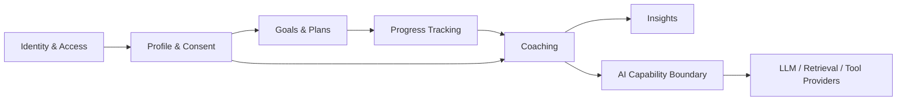

# Domain Model

## Why

A shared domain model prevents persistence tables, UI screens, and AI-provider concepts from becoming the product's de facto architecture.

## What

The proposed modular-monolith boundary is illustrated below. It is a working hypothesis, not a committed data model.

Candidate concepts include identity, profile, consent, goal, plan, progress record, coaching interaction, and insight. Workout and habit concepts remain candidates only; the MVP domain is not yet decided.

## How

Model behavior inside bounded contexts; expose explicit application interfaces between modules; and keep provider-specific AI concerns behind the AI capability boundary. Confirm aggregates only through approved product requirements and ADRs.

## Future Considerations

Add context maps, aggregate invariants, lifecycle rules, events, and data classifications after the MVP is defined.

## Open Questions

Human decision required: select the MVP domain, primary user outcome, tenancy model, and personal-data retention rules.
